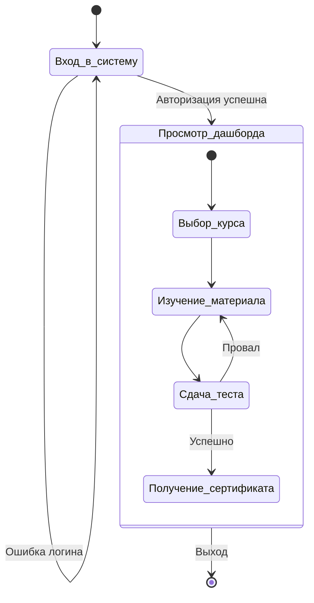
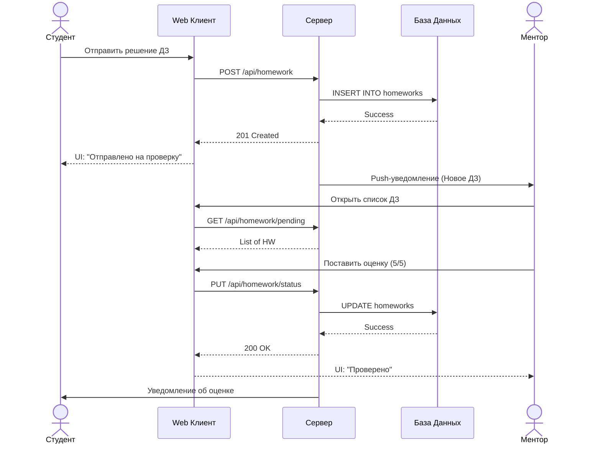
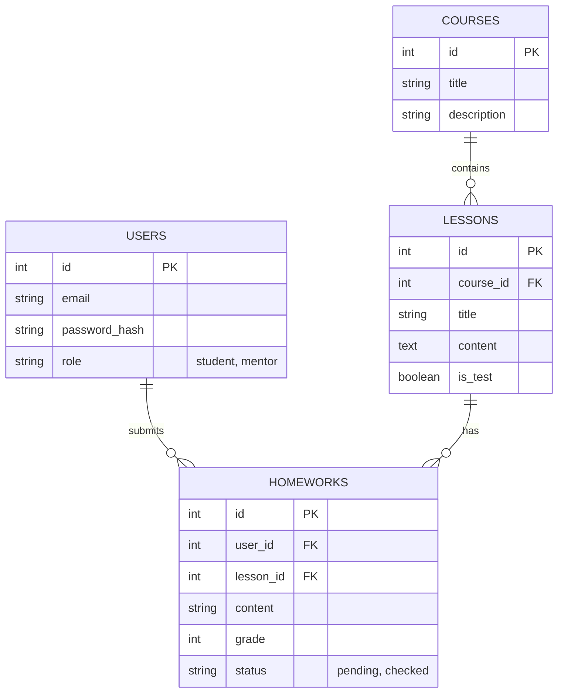

# Презентация проекта: Образовательная платформа IT-Mentor
**Подготовили:** Студент и Николай

---

## 1. Архитектура приложения и взаимодействие с БД

Приложение построено по клиент-серверной архитектуре. Взаимодействие между веб-сайтом, локальным приложением и базой данных осуществляется через REST API.

*(Схема иерархии приложения и взаимодействия с базой данных)*

---

## 2. Диаграмма активности пользователя (Activity Diagram)

Детальное описание действий пользователя в системе.

---

## 3. Взаимодействие ролей с системой (Sequence Diagram)

Реакция приложения на действия пользователя (сдача домашнего задания и проверка).

---

## 4. Схема хранилища данных (ER Diagram / Class Diagram)

Структура базы данных и взаимосвязь сущностей.

---

## 5. Скриншоты экранов приложения

*Вставьте сюда реальные скриншоты вашего приложения.*

> **Скриншот 1:** Экран входа (Login Screen)  
> `[ Место для скриншота: login.png ]`

> **Скриншот 2:** Дашборд студента с курсами и прогрессом  
> `[ Место для скриншота: student_dashboard.png ]`

> **Скриншот 3:** Панель ментора с заданиями на проверку  
> `[ Место для скриншота: mentor_dashboard.png ]`

> **Скриншот 4:** Полученный сертификат  
> `[ Место для скриншота: certificate.png ]`

---

## 6. Сравнительный анализ и выводы

### Сравнительная таблица видов тестирования

| Критерий | Нагрузочное API тестирование (Load Testing) | Юзабилити-тестирование (Usability Testing) |
| :--- | :--- | :--- |
| **Цель** | Проверка стабильности и скорости работы системы под высокой нагрузкой. | Оценка удобства интерфейса и пользовательского опыта (UX). |
| **Что проверяет?** | Время ответа (ms), пропускную способность, потребление ресурсов, работу БД при 1000+ запросах. | Цветовую гамму, расположение кнопок, понятность навигации, доступность элементов. |
| **Пример в нашем проекте** | Отправка 50-100 одновременных запросов на загрузку контента урока через Playwright API context / k6. | **Проверка некорректного (красного) цвета кнопки оплаты**, чтобы предотвратить отток пользователей. |
| **Кто проводит?** | QA Automation / Performance Engineer (с использованием k6, JMeter, Playwright). | QA / UX Researcher (мануально или E2E с проверкой стилей CSS). |
| **Результат** | Allure отчет со временем выполнения запросов и % ошибок. | Найденные визуальные дефекты и баги логики интерфейса. |

### Общие выводы
1. **Качество продукта:** Разработанная система IT-Mentor отвечает заявленным требованиям и имеет надежную архитектуру (Web SPA + REST API + БД PostgreSQL).
2. **Обеспечение качества:** Внедрен процесс автоматизированного тестирования. Использование Playwright позволило покрыть E2E сценарии, API нагрузку и UI/UX аспекты в рамках единого инструмента с интеграцией красивых Allure-отчетов.
3. **Готовность к запуску:** Юзабилити-баги (такие как цвет кнопки оплаты) были выявлены и будут устранены, а API выдерживает необходимую нагрузку. Проект готов к деплою и бета-тестированию на первых пользователях.
