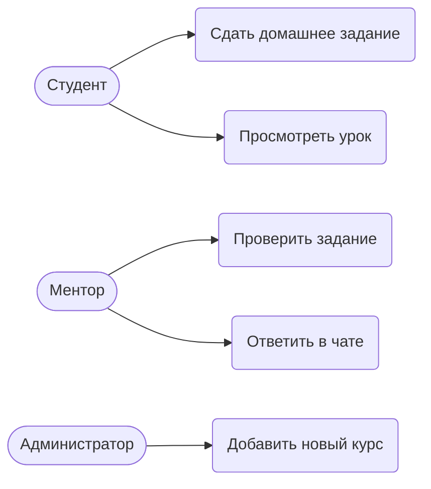
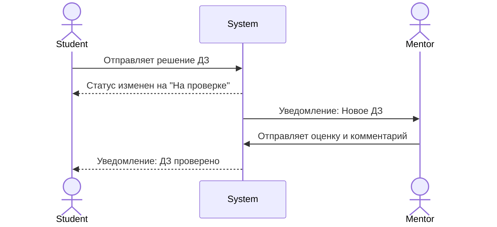
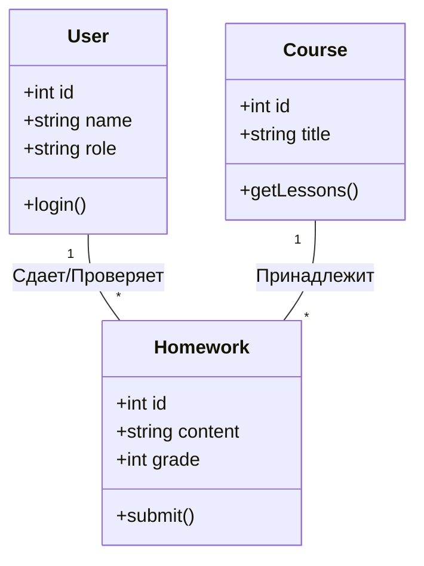

# Отчет по проектированию информационной системы
## Тема: Образовательная платформа для IT-менторства (например, курсы по QA)

### Этап №1. Описание предметной области

**Миссия компании:**
Предоставление качественного, практико-ориентированного IT-образования через прямое наставничество для быстрого и успешного старта карьеры студентов.

**Деловая концепция компании:**
*   **Что получит Заказчик (Студент):** Актуальные знания, проверку практических заданий от действующих специалистов, карьерные консультации, сертификат и портфолио.
*   **Кто, для чего и как может выступать в качестве партнера:** IT-компании (для найма лучших выпускников и стажировок), независимые IT-эксперты (в качестве приглашенных лекторов).
*   **Отношения с конкурентами:** Возможны компромиссы в виде кросс-промоушена (например, обмен аудиторией с курсами по английскому для IT), нишевое позиционирование (фокус только на QA и разработке, без дизайна).
*   **Что получит собственник и акционеры:** Прибыль от продажи курсов, капитализацию бренда на рынке EdTech.
*   **Что получат менеджеры:** Профессиональный рост в сфере управления EdTech, бонусы за выполнение KPI по продажам и удовлетворенности студентов.
*   **Что получит персонал (Менторы, преподаватели):** Дополнительный заработок, развитие личного бренда, прокачку софт-скиллов, нетворкинг.
*   **Сотрудничество с общественными организациями:** Проведение бесплатных открытых вебинаров для популяризации IT-профессий среди молодежи.
*   **Отношения с государством:** Участие в государственных программах переквалификации кадров (например, «Цифровые профессии»), уплата налогов, соблюдение законодательства в сфере образования.

**Структура организации:**
Генеральный директор (CEO)
├── Технический директор (CTO)
│   ├── Отдел разработки ИС
│   └── Системное администрирование
├── Директор по образованию (Head of Education)
│   ├── Методисты
│   └── Менторы / Преподаватели
└── Директор по маркетингу (CMO)
    ├── Отдел продаж
    └── Отдел продвижения и PR

---

### Этап №2. Выявление задач решаемых с помощью ИС

**Анкета для руководителя (Директора по образованию):**
1.  *Цели ИС:* Автоматизация выдачи уроков, сбора домашних заданий (ДЗ) и контроля качества работы менторов.
2.  *Орг. структура:* Методисты создают контент, менторы его проверяют.
3.  *Задачи:* Распределение студентов по менторам, контроль успеваемости, анализ обратной связи.
4.  *Последовательность:* Студент покупает курс -> Система открывает доступ -> Студент сдает ДЗ -> Система назначает ДЗ ментору -> Ментор проверяет.
5.  *Внешние организации:* Платежные шлюзы (банк), сервисы рассылок.
6.  *Отчеты:* Еженедельный отчет по успеваемости потока и скорости проверки ДЗ менторами.

**Описание функций и бизнесов:**
*   **Бизнес (Продукт):** Продажа доступа к образовательным программам (курсам).
*   **Услуга:** Сопровождение обучения (менторство, проверка ДЗ, консультации).

**Функции управления:**
*   Управление пользователями и их ролями.
*   Управление контентом курсов (CRUD операций для уроков).
*   Управление процессом обучения (трекинг прогресса, система оценок).
*   Финансовый учет (интеграция с эквайрингом).

**Зоны ответственности и Роли:**
1.  **Администратор:** Настройка системы, добавление курсов, управление правами, решение технических проблем.
2.  **Ментор:** Проверка домашних заданий, выставление оценок, написание комментариев, ответы на вопросы студентов.
3.  **Студент:** Просмотр материалов, выполнение заданий, отправка решений на проверку, отслеживание своего прогресса.

**UML Схемы (Прецеденты, Последовательность, Классы):**

*Диаграмма прецедентов (Use Case):*

*Диаграмма последовательности (Sequence - Сдача ДЗ):*

*Диаграмма классов (Class Diagram - Схема данных):*

---

### Этап №3. Описание общей схемы ИС

**Общая схема (Хранилище + Среда доступа):**
Система строится по клиент-серверной архитектуре.
*   **Клиент (Среда доступа):** Web-приложение (SPA), работающее в браузере. Выполнено с использованием HTML/CSS/JS (или фреймворка React/Vue).
*   **Сервер (Среда доступа):** Backend API (например, на Python/FastAPI или Node.js), обрабатывающий бизнес-логику.
*   **Хранилище данных:** Реляционная СУБД (PostgreSQL).

**Схема доступа к данным:**
*   ORM (Object-Relational Mapping) используется для связи Backend приложения и PostgreSQL.
*   Доступ к API защищен JWT (JSON Web Tokens).

**Разработка хранилища данных (Валидность):**
*   Таблица `Users` (email должен быть уникальным, password захеширован).
*   Таблица `Courses` (title не пустое).
*   Таблица `Homeworks` (связь Foreign Key с User и Course. Оценка от 1 до 100, либо статус pass/fail). Транзакции обеспечивают атомарность (например, при оплате курса).

**Разработка приложения (Функционал):**
*   *Авторизация:* Регистрация, Вход, Восстановление пароля. Генерация сессионных токенов.
*   *Функционал:* Личный кабинет, видеоплеер для лекций, текстовый редактор для сдачи кода/текста ДЗ, панель ментора со списком задач.

**Скрин-формы (Описание работы):**
1.  *Экран входа:* Поля Email и Пароль, кнопка "Войти".
2.  *Дашборд студента:* Карточки доступных курсов, прогресс-бар (например, пройдено 5 из 20 уроков), кнопка "Продолжить обучение".
3.  *Форма сдачи ДЗ:* Текстовое поле, область для прикрепления файлов, кнопка "Отправить".
4.  *Дашборд ментора:* Таблица со списком ДЗ от студентов (Колонка статуса, Дедлайн). При клике открывается модальное окно для ввода оценки и фидбека.

**Тестирование и нагрузка:**
*   Тестирование API с помощью Postman (проверка кодов ответа 200, 400, 401).
*   Нагрузочное тестирование: Система рассчитана на 1000 одновременных пользователей (DAU). Узким местом может быть отдача видео-контента, поэтому видео будут хоститься на CDN (например, AWS CloudFront или Vimeo).

---

### Этап №4. Вывод

1.  **О возможностях выбранных технологий:** Использование связки Web-технологий (HTML/CSS/JS) + REST API + PostgreSQL обеспечивает высокую скорость разработки, надежность хранения данных и современный пользовательский опыт.
2.  **О тестировании и работоспособности:** Разработанная архитектура позволяет проводить юнит и интеграционное тестирование. Разделение на Frontend и Backend минимизирует риски полного падения системы.
3.  **О расширяемости и кроссплатформенности:** Web-приложение по умолчанию является кроссплатформенным (работает в браузере на Windows, macOS, Linux, мобильных устройствах). При необходимости API позволяет легко подключить нативные мобильные приложения (iOS/Android) в будущем без переписывания бэкенда.
